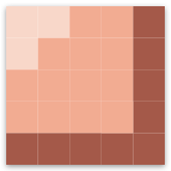

<h1>  Pixels - Learn Programming through Pixel Art </h1>
<p align="center">
  
</p>

Pixels is an interactive learning platform that aims to teach highschool students programming by allowing them to create pixel art on a canvas using any programming language.


## Introduction

Pixels introduces students to the exciting world of programming by enabling them to create and manipulate pixel art simple through writing code in any programming language. Learners can develop their programming skills, as well as their creativity and problem-solving abilities.

## Features

- Interactive canvas for creating pixel art
- Simple API calls for placing and manipulating pixels
- Real-time updates for a collaborative experience

## Prerequisites

- [Node.js](https://nodejs.org/) >=18.x
- [pnpm](https://pnpm.io/installation) >=8.x
- [Docker](https://www.docker.com/) >=23.x

## Development

1. Clone the repository:

```sh
git clone https://github.com/pixelcorp-nl/canvas.edu.git
cd canvas.edu
```

2. Set up environment variables
```shell
cp frontend/.env-example frontend/.env
# by default you don't have to change anything in the .env file
```

3. Start dependencies (database, etc.)
```sh
make start-deps
```

4. Start the development server

```sh
# Install pnpm if you do not have it already.
# npm install -g pnpm

cd frontend
pnpm install
pnpm run dev
```

5. Pixels is ready at http://localhost:5173

6. Send pixels.
Since your development environment is running on localhost you will not be able to reach it with trinket.
Instead you can use python locally on your computer.
The Key from the info page does not work in the development env currently, untill this is fixed the key "joppe" can be used.

Here are some python cli tips to get you started:
```sh
# install a python package
pip3 install <package>

# run a python script
python3 putpixels.py
```

## Code structure
The project consists of 3 parts:
1. `frontend` - The frontend of the application, built with [SvelteKit](https://kit.svelte.dev/)
2. `redis` - The Redis database for storing pixel data
3. `postgres` - The Postgres database for storing user data and other information

If you break the database(s), you can clear them by:
```shell
# cd to the root of the project
make nuke-postgres # if you want to clear the postgres database
make nuke-redis # if you want to clear the redis database
make nuke-all # if you want to clear both databases
```


Pixels is released under the [MIT License](LICENSE)
